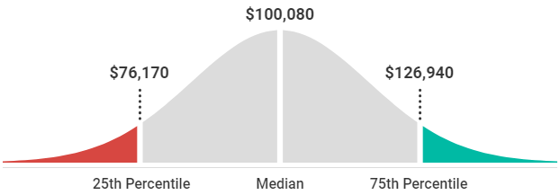

My coworkers and I have had many conversations about what our job actually is. Is it coding? Testing? Design? What about our skills translates to higher pay over those that do more demanding jobs? (Think police, first responders, military)

Even my own family seems shocked when they hear that I make a decent living sitting in front of a computer typing and in meeting rooms all day.  [A](https://dccoder.files.wordpress.com/2020/09/0c62b-payscale.png)ccording to [UsNews Money](https://money.usnews.com/careers/best-jobs/software-developer/salary), in 2016 the median salary for a software developer was $100,080 annually.

 

This pay is for good reason, it comes down to three basic factors:

## **Problem Solving**

While developers do code, the primary reason they are hired is not because they can program but because they are good problem solvers.  Let's look at a very common interview question given by employers, one that I was even tasked with at a previous interview.

> You are given a sorted array and you want to find the number N. How do you do the search as quickly as possible (not just traversing each element)?

As this question states you can't just loop through the entire array to find the number you're looking for.  Many not in development, or that have not taken computer science, may not be sure how to solve this.   Most developers, however, will tell you that the most efficient way of solving such an issue is going to be the [Binary Search](https://en.wikipedia.org/wiki/Binary_search_algorithm). In a Binary search we basically just keep "halfing" the array until we find our number, and the length of time it takes to complete this search, measured in [Big O](https://en.wikipedia.org/wiki/Big_O_notation), is very good being O(log n).

These are the types of issues that many developers will come to see on an almost daily basis and as such they have to be good problem solvers.

## **Multi-tasking**

Nearly every software developer I have met agrees that this is a factor that helps determine how proficient they are.  Due to the move to Agile methodologies many teams are now expected to be cross-disciplined.  Rather than simply working in just one area a developer now has to work across all facets of an application.  Within the few short months of being at my new job I have worked on Front-end, Back-end, Database, and all of these in dozens of different projects, often jumping between 3 or more projects a day.

 

Due to the constant switching around and changing areas developers are fully expected to be "quick on their feet" and make jumps with minimal hits to productivity.

## **Fast Learner**

It's no surprise that technology is constantly changing.  I'm sure even you have complained when buying a new computer or phone that the second you bought it, the item was "out of date".  While that may not be completely true, things change fast in our industry, at least every 6 months a new framework is released, or an update has been pushed out that changes everything.  Due to this developers have to be fast learners, often spending personal time just keeping up with trends and languages.

Thankfully, while things change it's usually not dramatic to those that have been staying on top of things.  Developers are constantly learning, usually at least one new language or massive framework every year.

## **Conclusion**

Obviously this article is my own personal opinion and is not to discredit other professions that have to do these actions as well.  It is my firm belief that the primary reason software developers are paid so well are due to the above factors as well as the ability to code, and code well.  The primary reason that I say it's due to problem solving, multitasking, and fast learning rather than just coding alone is that I have met many decent coders that once taken outside of their comfort zone, floundered.  You have to be able to quickly adapt to the needs of the business, or if you are a contractor, multiple businesses.
