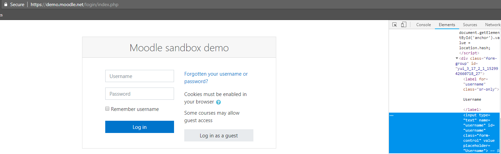
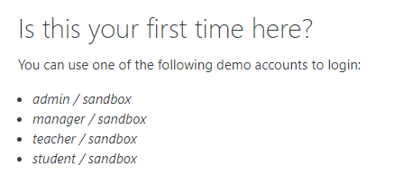
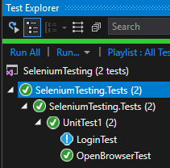
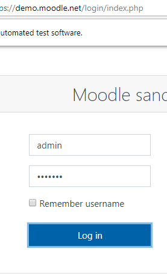
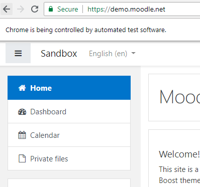
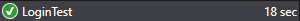

In [Part 1](http://dccoder.com/2018/06/automated-ui-testing-with-selenium/) we set up Selenium and created our first test showing a browser being opened and then immediately closing.  While that was interesting, I don't know many people that would be super exciting by that alone.  Since the whole point of these tutorials is UI testing, why don't we actually test a UI?  In this article we're going to walk through creating a few more tests to actually log in to a website and verify that only a user with the right credentials can log in, we don't want just anyone logging in now do we?

- [Continuing where we left off](2018-06-27-automated-ui-testing-with-selenium-part-2.md##ilink_continue)
- [Running the test](2018-06-27-automated-ui-testing-with-selenium-part-2.md##ilink_running)
- [Congrats](2018-06-27-automated-ui-testing-with-selenium-part-2.md##ilink_congrats)

# Continuing where we left off

We left off with just some simple code that only opened a web browser and then immediately closed it passing the test.  This is actually a good thing!  We expected this test to pass because all we wanted to check was if Selenium was actually installed and working correctly.  Now, however, it's time to add on to that.  Now let's actually log in to a website, what do you think about the admin section of DCCoder?  That's what I thought.....NO.  But, thankfully [Moodle](https://moodle.net/), the open-source learning management system, has a nice little demo area where they kindly provide login details and have no TOS against automated software visiting their site.

So let's head over to [https://demo.moodle.net/login/index.php](https://demo.moodle.net/login/index.php) (which is the login are for their demo application) and take a look around.  We'll need to gather some details before we can actually write a test to log in to the site.  In order for Selenium to interact with a website we will need to get the "id" tags of the fields we want to interact with.  To do this, I simply visited the site and right-clicked on the field I wanted to look at.  Once the context menu pops up simply click "Inspect element", this will cause a window with the pages source to appear and the element highlighted.

 

Take a look at the screen below and you can see how easy it is to grab this information.  Now let's grab the Username, Password, and Login button ids.

 

Once you've went through and grabbed them then you should have details similar to mine below:

- Username - username
- Password - password
- Login Button - loginbtn

Great!  Let's just make a note of those, now if you will scroll down the page just a wee little bit, you'll see the login information.

 

As you can see this is fairly straight forward.  The one I will be testing in this tutorial is going to be the admin account, but you could easily choose whichever you wanted.

 

 

 

Ok good!  Now we have all the details that we need to start writing our new test to login!  Lets add a new TestMethod to our existing class, we'll call this method "LoginTest" to signify what we are testing.

\[cc lang="csharp" escaped="true"\] using System; using Microsoft.VisualStudio.TestTools.UnitTesting; using OpenQA.Selenium; using OpenQA.Selenium.Chrome;

namespace SeleniumTesting.Tests{   public class UnitTest1{     private IWebDriver \_driver;

    \[TestInitialize\]     public void Init(){       \_driver = new ChromeDriver();     }

    \[TestMethod\]     public void OpenBrowserTest(){       \_driver.Url = "http://www.dccoder.com";     }

    \[TestMethod\]     public void LoginTest(){       \_driver.Url = "https://demo.moodle.net/login/index.php";

      IWebElement username = \_driver.FindElement(By.Id("username"));       IWebElement password= \_driver.FindElement(By.Id("password"));       IWebElement loginButton= \_driver.FindElement(By.Id("loginbtn"));

      username.SendKeys("admin");       password.SendKeys("sandbox");       loginButton.Click();

      System.Threading.Thread.Sleep(5000);     }

    \[TestCleanup\]     public void Cleanup(){     \_driver.Close();     }   } } \[/cc\]

 

As you can see we now have our method created.  We set the driver's URL to the appropriate page and then create a few IWebElements.  IWebElement is an interface defined by Selenium that allows us to interact with elements on a webpage (table, button, input field, image, etc).  We get these by using the webdriver's FindElement method, using this in conjuction with By.Id allows us to select an element using it's CSS id, as you'll see in a few minutes there are many other ways we can select elements as well.

Once we have our elements selected we use the SendKeys method on the inputs.  SendKeys is a way of placing data into input fields by simulating keystrokes, granted its really fast but you'll be able to actually see it typing everything out.  One of the other input methods that we use is "Click", I'm sure by it's name no explanation is needed.   Finally, we end the test by just "sleeping" for 5 seconds.  The only reason we're doing this is so that it doesn't immediately close and you can see that it did, in-fact, work.

Now on to running the test!

# Running the new test

Now if you rebuild your solution (CTRL+Shift+B) you will notice a new test appear in your test explorer.

 

 

 

 

 

 

 

Click "Run All" again and see what happens.  You should see your first test run and the browser window popup then close.  Your new test should then appear, you should see the browser window popup, go to Moodle, login, then pause for 5 seconds before closing again and marking the test as "Passed".

 

 

 

 

 

 

 

 

 

 

 

 

 

This is great!  It actually logs in!  Now we're getting somewhere!  But, there is a problem here, I don't know if you've noticed.  Currently the test passes (as indicated by the green) when it logs in.  Try changing the password to something else and rerunning it and see what happens.

Uh oh, this is an obvious problem.  We want the test to fail when it doesn't log in, and only pass upon a successful authentication, but how do we do this?  Well we need to identify something that only a logged in user (under normal conditions) will see.   The "Admin User" box at the top right of the screen (when you're logged in) seems to be a good reference point.

 

 

If we inspect this element, we can see that it has a CSS class of "usertext", this is how we will check if we are logged in with Selenium.

\[cc lang="csharp" escaped="true"\] using System; using Microsoft.VisualStudio.TestTools.UnitTesting; using OpenQA.Selenium; using OpenQA.Selenium.Chrome;

namespace SeleniumTesting.Tests{   public class UnitTest1{     private IWebDriver \_driver;

    \[TestInitialize\]     public void Init(){       \_driver = new ChromeDriver();     }

    \[TestMethod\]     public void OpenBrowserTest(){       \_driver.Url = "http://www.dccoder.com";     }

    \[TestMethod\]     public void LoginTest(){       \_driver.Url = "https://demo.moodle.net/login/index.php";

      IWebElement username = \_driver.FindElement(By.Id("username"));       IWebElement password= \_driver.FindElement(By.Id("password"));       IWebElement loginButton= \_driver.FindElement(By.Id("loginbtn"));

      username.SendKeys("admin");       password.SendKeys("sandbox");       loginButton.Click();

      IWebElement loginNotice = \_driver.FindElement(By.ClassName("usertext"));

      if(loginNotice.Text == "Admin User"){         return;       }else{         Assert.Fail(); //If we didn't login as the admin user, something went wrong...fail the test       }     }

    \[TestCleanup\]     public void Cleanup(){       \_driver.Close();     }   } } \[/cc\]

As you can see we are now grabbing this element but by the class name instead of the id.  Once we have it we are checking the text to see if it is equal to "Admin User".   If the usertext is Admin User then we obviously logged in correctly so we just return out, otherwise we are going to force the test to fail.

> Note: Keep in mind that this text may have changed by the time you read this in the far off future.  If it has the same principles apply.

 

# Congrats

Congratulations!  You have successfully written your first few tests using Selenium!  Now, I challenge you to write another test to check for failed logins, use the same methods and principles that we used creating this test but you want to force a failed login and check if the error text is present.  For now I'll leave you with this.  Go forward and keep learning!  Selenium is a power framework with many uses.
