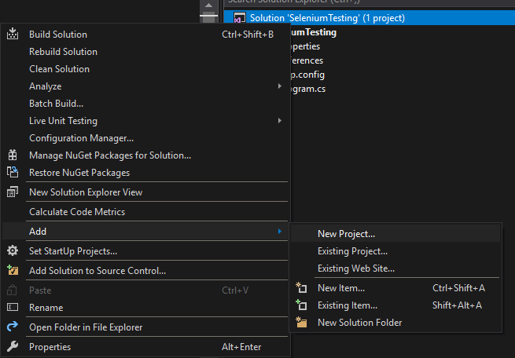
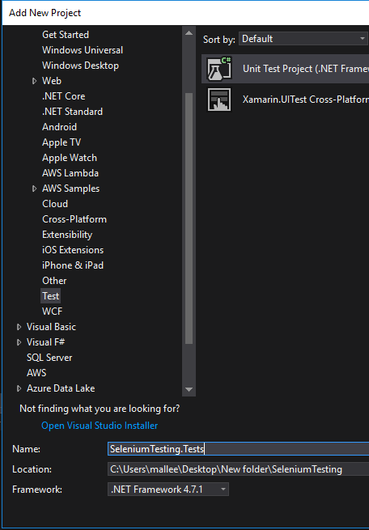
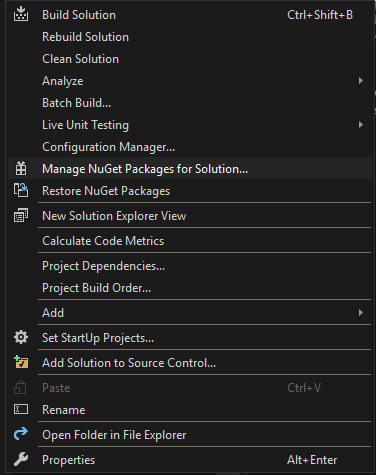
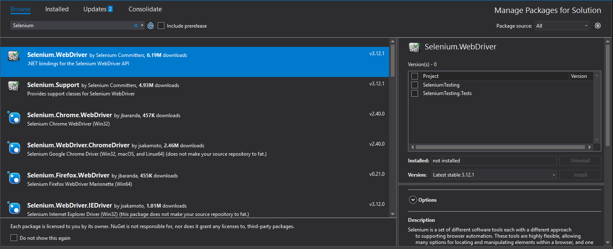
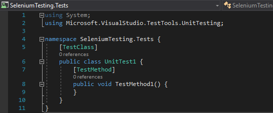
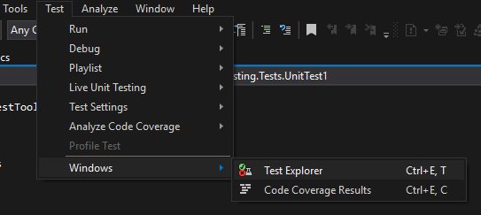
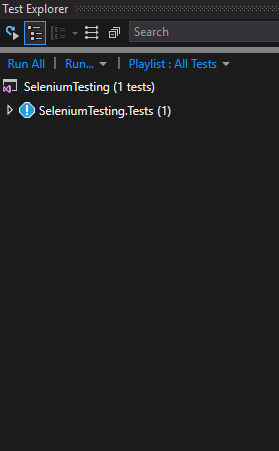
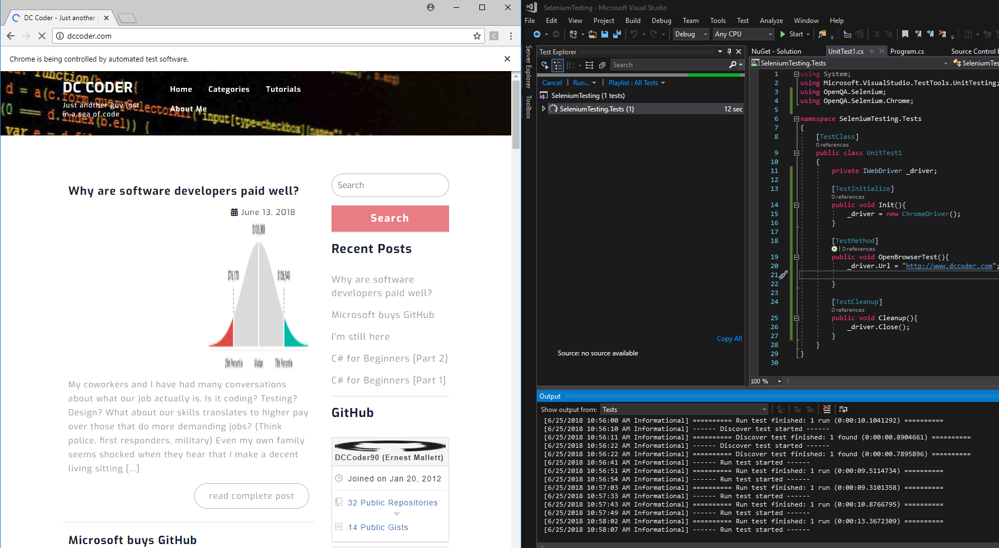

It seems everyone is making the move towards automated testing these days, and why shouldn’t they? How many times have you been working on a web project and had to constantly retest the same thing over and over simply to verify that it works? Or maybe you’re an analyst on the surface but a code monkey at heart and would like to blend the two together? Enter Selenium.

What is Selenium? Selenium is a browser automation framework. I was exposed to it a few years ago when I was still heaving into web scraping. Selenium is perfect for UI testing as it can easily mimic an actual browser with human input. You can even change the type of browser you want! Ok, so hopefully by this point you’re interested (or maybe not) and want to get started.

- [Assumptions](#ilink_assumptions)
- [Getting set up](#ilink_setup)
- [Creating our first test](#ilink_firsttest)
- [Running the test](#ilink_running)

# Assumptions

I am going to make a few assumptions during the article, namely the following:

- You have visual studio installed
- You have a basic understanding of visual studio
- You have basic understanding of C#

If I have assumed wrong then I apologize, but you are more than welcome to reach out to me if you have any questions or concerns.

# Getting set up

First, lets get everything set up and ready.  For this tutorial I simply created a new console application, but you can use this even if you're just wanting to add on to an existing project that you've been working on.  Maybe an MVC or Webforms project?  Ok, let's start by adding a new project to our solution.  We're going to be adding a Unit Test project to the solution.  Simply look under Visual C#, and then under the "Test" category and select "Unit Test Project (.NET Framework)".  Common naming convention is to name it the project name you are testing followed by '.Tests", so I'll be calling mine "SeleniumTesting.Tests" but you can call it whatever you may like.

 

Now that we have our Unit Test project set up we need to get a few Nugets.  The Nuget Packages we will be installing in our unit test project are:

- Selenium.WebDriver
- Selenium.Chrome.WebDriver

To do this, right click on your solution (the purple thingy) and select "Manage Nuget Packages".

 

 

 

 

 

 

 

 

 

 

 

 

 

 

Now you should see a new window appear.  In this window there is a search box at the top.  Search for "Selenium" and your screen should appear similar to mine below.  What you are going to want to do is select "Selenium.WebDriver" and on the right side of the screen check the checkbox next to your unit test project and click "Install".  You may get a notification about some dependencies, just hit "Accept".  Once this is installed we're going to follow the same steps for the "Selenium.Chrome.WebDriver" package.

Once we have these packages installed we're all set up and ready to create our first automated test!

# Creating our first test

Now that we have everything set up it's time we create our first test and see everything in action!  I'm sure this is the part that you've been waiting for (if you've read this far) so let's get right into it.  We're going to start off by opening the file that's automatically generated by Visual studio for us called UnitTest1.cs.

 

 

 

 

 

 

 

It should look just like the above image.  As you can see there isn't really a lot going on here, so it's up to us to fill everything in. We're actually going to start by removing the method that visual studio put in there for us so that we can start with a blank slate.  Once you remove that method, along with the accompanying attribute you should have an empty class named UnitTest1.  Now we can start programming our test and using Selenium!

Let's start by adding two using statements to allow us access some of the code in the OpenQA.Selenium namespace.

\[cc lang="csharp" escaped="true"\] using System; using Microsoft.VisualStudio.TestTools.UnitTesting; using OpenQA.Selenium; using OpenQA.Selenium.Chrome; \[/cc\] Now that we have those two in place it's time to declare a private variable.  This variable is going to be of type IWebDriver.  IWebDriver is an interface that defines the behavior of the Selenium web driver.  The Web driver is a very clean API that allows us to control and modify a browser's behavior through code.  So let's throw that in there.

 

\[cc lang="csharp" escaped="true"\] using System; using Microsoft.VisualStudio.TestTools.UnitTesting; using OpenQA.Selenium; using OpenQA.Selenium.Chrome;

namespace SeleniumTesting.Tests{   public class UnitTest1{     private IWebDriver \_driver;   } } \[/cc\]

Now that we have our WebDriver defined we need to initialize it, afterall what good is something that hasn't even been started?  We're going to initialize our WebDriver with the ChromeDriver, as I'm sure you can imagine this will call the Chrome webbrowser.  You could easily initialize it with Firefox, Edge, or any other number of supported browsers, I just chose chrome as it's my personal favorite.  We'll also establish a "Cleanup" method to shutdown the browser once we're done using it.

 

 

\[cc lang="csharp" escaped="true"\] using System; using Microsoft.VisualStudio.TestTools.UnitTesting; using OpenQA.Selenium; using OpenQA.Selenium.Chrome;

namespace SeleniumTesting.Tests{   public class UnitTest1{     private IWebDriver \_driver;

    \[TestInitialize\]     public void Init(){       \_driver = new ChromeDriver();     }

    \[TestCleanup\]     public void Cleanup(){       \_driver.Close();     }   } } \[/cc\]

The "TestInitialize" attribute marks a method to be run before a test is executed. We are initializing the driver in here so that way we can easily control it and ensure that it is set up for all of our tests. The "TestCleanup" attribute marks a method to be run after a test is performed, this makes sure that it is removed when we no longer need it and is just overall good practice. Now that we have our initialization and cleanup all ready, we're ready to write our first test! We're just going to write a simple one to ensure that Selenium is actually working and that it will actually show us a browser window. Let's start by making one that just goes to some website and then ends.  Any website will do, how about....DCCoder.com?

 

\[cc lang="csharp" escaped="true"\] using System; using Microsoft.VisualStudio.TestTools.UnitTesting; using OpenQA.Selenium; using OpenQA.Selenium.Chrome;

namespace SeleniumTesting.Tests{   public class UnitTest1{     private IWebDriver \_driver;

    \[TestInitialize\]     public void Init(){       \_driver = new ChromeDriver();     }

    \[TestMethod\]     public void OpenBrowserTest(){       \_driver.Url = "http://www.dccoder.com";     }

    \[TestCleanup\]     public void Cleanup(){       \_driver.Close();     }   } } \[/cc\]

As you can see we called our test "OpenBrowserTest" and gave it the "TestMethod" attribute.  I'm sure I don't have to explain it, but the TestMethod attribute tells the test runner that this is an actual unit test that we want to perform.  As you can see this is a fairly simple test that simply sets the URL property of the driver to "http://www.dccoder.com" and then ends.  The only way that this test should fail is if Selenium itself isn't installed or isn't working correctly.  Now press "CTRL+Shift+B" to build our entire solution.

Once your solution is finished building we need to open our Test Explorer.  The test explorer shows all current unit tests in our solution and allows us to run them and see their results.  In order to open the test explorer you're going to want to click on "Test" in the top bar of visual studio and then go down to the "Windows" section of the menu.  Here you should have a few options, click "Test Explorer" and a new window should appear showing your newly created unit test.

# Running the test

This is going to be a fairly quick section but I decided to give it it's own because I personally love seeing something actually work.  Now that you have your unit test created and everything has been built, you should see a little blue link in the top of your test explorer that says "Run All".  Click that and watch some magic happen.

 

 

As you can see a Chrome web browser popped open, and then navigated to DCCoder.com then closed!  Wasn't that exciting?! I agree, that wasn't very much, we need to get it to do something a little more interesting to show off a little more.  Check out the next article [Automated UI testing with Selenium \[Part 2\]](http://dccoder.com/2018/06/automated-ui-testing-with-selenium-part-2/) and we'll actually log in to a website simulating key presses and button clicks!
