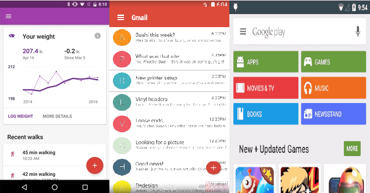
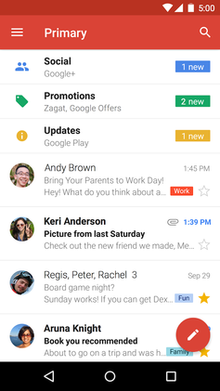
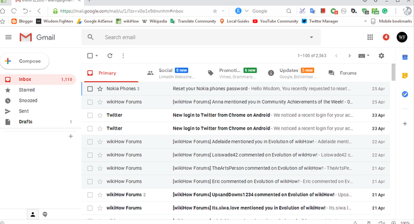

Lately there has been a lot of uptick in Material Design.  More bloggers are blogging, and more designers are designing, but as a developer what do you need to know about Material Design?  The best place to start is to define exactly what Material Design is.  [Wikipedia](https://en.wikipedia.org/wiki/Material_Design) defines this as:

 

> **Material Design** (codenamed **Quantum Paper**) is a design language developed in 2014 by Google. Expanding upon the "card" motifs that debuted in Google Now, Material Design makes more liberal use of grid-based layouts, responsive animations and transitions, padding, and depth effects such as lighting and shadows.

Though this description technically does describe it, we can do a little better.  Material Design is a design language that focuses on "materials" or objects with physical surfaces and edges.  This was primarily created with mobile application design in mind. These days, however, Material Design is being extrapolated into many other realms such as web development.

# What is Material Design?

Google has put together a great layout of the [specifications](https://material.io/design/introduction/#principles) of Material Design, essentially it was created for Android to create a better and more standardized method of creating user interfaces.  Have you noticed Google's applications all have a standard look and feel?

As stated earlier this approach focuses on physical "materials" such as those that we interact with when we are [afk](https://www.grammarly.com/blog/afk-meaning/).  Like physical materials users should be able to seamlessly interact with them and the materials should behave appropriately.  When you swipe a penny on your desk, does it not "flick" in the direction you swiped it?  Now think about many common menus in apps these days.  You can swipe right to open the menu, and then swipe it back to the left to close it.

Each of these materials are then "layered" on top of each other to give us the look and feel that we have become accustomed to.  Material objects are commonly considered the "interact-able" part of the application: circular buttons, rectangular bars, etc.  Content is a little different, content is considered to be laid out on materials, content is usual text, video, and images.  Each part of the application is represented by it's own material.  Let's use Google's Gmail application as a visual reference:

In Google's Gmail android application (pictured above) we can see that it has a white background.  This background would be the first material and reside on the bottom most later of the application.  The red navigation bar located at the top of the application would again be a separate material with the content "Primary" located on it.  Hopefully this helps making things a little more clear in how applications using material design are laid out.

The most important thing to remember is that Material Design is a language, not some UI Library or collection of elements like [Telerik](https://www.telerik.com/) or [Syncfusion](https://www.syncfusion.com/) but is simply a new way of looking at, imagining, and talking about user interfaces.

 

# Why should you use it?

## Hard-work Done

Material design has already been created, developed, and perfected.  All of the hard work is done, with the specifications published on [Material.IO](https://material.io/) it is easy to familiarize yourself with it.  Developers are developers because [they're lazy](https://jaxenter.com/results-developers-strategically-lazy-113513.html), no one wants to reinvent the wheel.  Hitch a ride on the back of Google and have a great looking and user friendly application with minimal hair pulling.

## Maintenance

Every time a new developer joins the team they usually have a "spin-up" period.  They have to familiarize themselves with the code, the architecture, team dynamic, and a multitude of other things.  After release comes the most expensive and time-consuming part of software development, Maintenance.  Teams of developers have to work consistently to ensure the software remains updated, and bug fixes are implemented.  Throughout the "[Maintenance](https://www.techwalla.com/articles/the-maintenance-phase-in-the-software-life-cycle)" area of the [SDLC](https://www.techopedia.com/definition/22193/software-development-life-cycle-sdlc) developers will often come and go further increasing costs by having more individuals in "spin-up".  The most effective way of reducing costs during maintenance is to "standardize" your project.  Having a set of industry standards guiding your hand throughout the design and development process will help to radically speed up how quickly an individual gets comfortable with your product.

## User Experience

With Material design everything is based on realistic visual cues making it clear to the user what is intractable and what the outcome of their decision will be.  Personally, as a software user, I do not want to have to think.  I don't want to wonder how to open a menu, or what is going to happen if I click this button.  Everything should be laid out clearly and self-explanatory.  Mr. Walanski wrote a great article on UI design with Material design titled "[Don’t risk making a crappy UI, use Material Design](https://uxplanet.org/dont-risk-making-a-crappy-ui-use-material-design-520ebaceffe4)" that I definitely recommend.

By following the Material Design specifications it will practically hand you a wonderful and easy UI with a great user experience.  As proof in point pull out your phone and look at any android application developed by Google, or for you Apple users out there, just open up Gmail in your browser.  Everything is easy to find, and you don't have to wonder "what does this button do?".

 

# Closing

In closing Material design is an amazing design language made to make developers and designers' lives easier.  The specification was written but a bunch of individuals much more intelligent than I at a tech giant.  Overall it looks great, and functions amazingly.  While I would greatly advise others to look into it, I will admit that it is not a Swiss army knife.  While it addresses many needs, your organization or projects may call for something different, and there is certainly nothing wrong with that.
