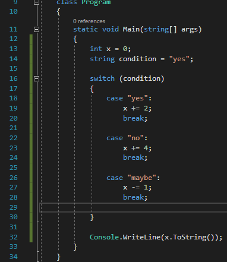
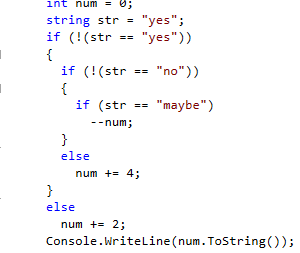
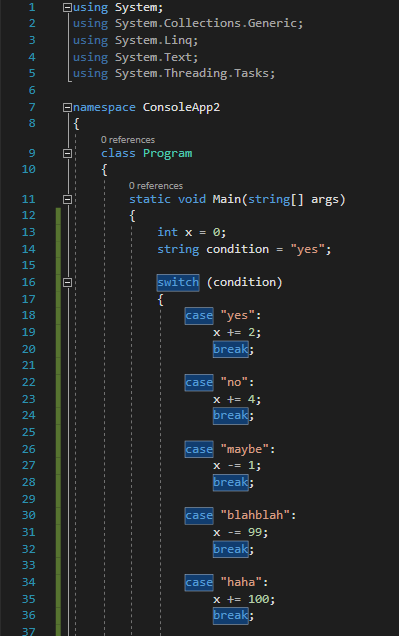
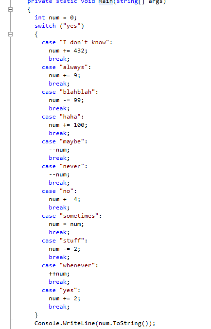
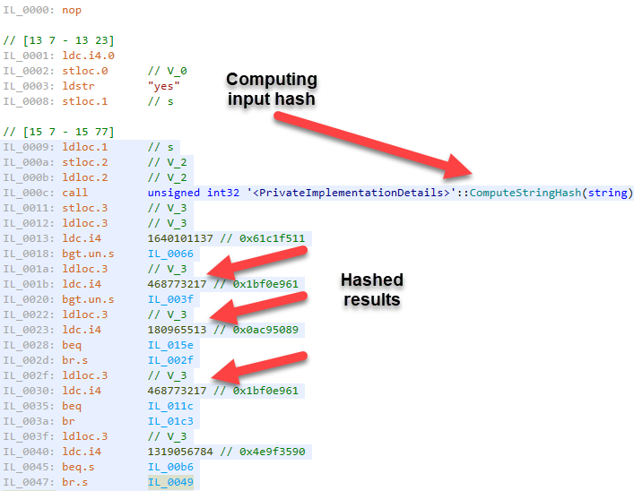
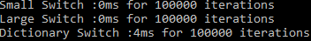
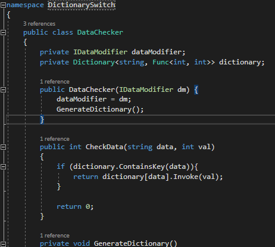

.NET languages have a variety of forms of flow control, if statements are easily among the most noticeable. When having to compare multiple statements it is common practice to utilize switch statements due to it's improved performance, but is there another way? It turns out there is!  We can actually use a dictionary and delegates for flow control! Before we delve into this, how exactly are switch statements utilized by the compiler?

## TLDR;

You can use dictionaries in place of large switches and the code is found [here](https://gist.github.com/DCCoder90/8ae3449a240a936e120bddc43f686b8b).

## Checking out switches

To start I made a small useless program with a fairly small switch statement only using 3 cases.

\[caption id="attachment\_936" align="aligncenter" width="382"\] Small switch statement in c#\[/caption\]

Once I compiled the program I used JetBrain's DotPeek to take a look at the de-compiled source.  Interestingly enough the compiler actually turned this into a nested if-not statement.

\[caption id="attachment\_937" align="aligncenter" width="300"\] Small switch statement decompiled\[/caption\]

 

As you can see the compiler can look at the code and automatically tell that a switch may not be the best case here.  As far as readability goes, I personally prefer it, but as far as performance goes, we should be using if statements.

 

## What about a larger switch?

After thinking about this I decided to make a much larger switch statement containing 11 cases.

 

\[caption id="attachment\_939" align="aligncenter" width="399"\] Large Switch Statement\[/caption\]

As you can see this is pretty much the same thing just with several more cases.  Usually one would expect this to perform in the same manner since you're still calling the same command.  But let's take a look at it under a decompiler.

 

\[caption id="attachment\_948" align="aligncenter" width="434"\] Large switch decompiled\[/caption\]

Well that's interesting.  Under the decompiler it looks like the same thing we passed in.  Let's try taking a look at the IL Code.

 

\[caption id="attachment\_947" align="aligncenter" width="707"\] IL Code for a decompiled switch with many cases\[/caption\]

Now we're getting somewhere!  Looking at the IL code we can see that each of the cases were actually hashed by the compiler, and it's actually calling ComputeHashString on the input.  This drastically improves lookup times because the hashing function is fast.  And with the hash in hand, it can lookup for the value in O(1) time.  This makes it much faster than having to continue to evaluate conditions as it would have to in a collection of if statements.

## The Theory

So this is what got me thinking.  If a larger switch is using a hashing function to perform quick lookups, could we instead use a dictionary?  Now, why would I even think of a dictionary?  Well, that's because a Dictionary is simply a generic hashtable.  So in theory it should be just as fast as performing a larger switch, but it should be much more maintainable.  Sure a switch with 6 or 7 cases isn't that bad, but when you get to the double digits it starts to become a headache.

So I decided to test this theory and put it into action.

 

## Execution

So to get started I decided to start out by removing all of the logic from my cases and placing them in their own methods in a class.  Due to the number of cases this took a few moments to do, but in the end was fairly simple to perform.  Once this was completed I created another class that was essiantly going to be the actor.  This class would store the dictionary, perform the lookup, and invoke the action.  Last but not least was the program itself, which I simply fed "yes" and a value of 0.

With everything put together I decided to give it a go and it worked!

 

## Benchmarking

Once I proved that it could work I created a few programs.  One with a small switch, one with a larger one, and one that used a dictionary.  Once they were all up and running I decided to do some benchmarks.

\[caption id="attachment\_959" align="aligncenter" width="352"\] Benchmark Results\[/caption\]

Needless to say I was fairly surprised.  While the dictionary switch was faster by 4ms (this number remained consistent) I believe some of that time could be due to class initialization among other things.

 

## Flexibility

I decided to make this slightly more flexible by creating an interface and having an implementing class passed in.  This would allow us to continue to use the same switch for varying degrees of logic.

 

\[caption id="attachment\_960" align="aligncenter" width="462"\] Data Checker showing use of interface\[/caption\]

 

## The Code

If you would like to see my implementation of this feel free to check out the Gist containing all the files below!

[https://gist.github.com/DCCoder90/8ae3449a240a936e120bddc43f686b8b](https://gist.github.com/DCCoder90/8ae3449a240a936e120bddc43f686b8b)
