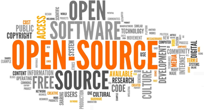

It's no secret that the world runs on open-source. From our Apache and NGinx webservers, our Ubuntu server OS's, even our .NET and python programming languages. However, how many think that this could potentially be an issue?

Now, hear me out. I'm not some doomsayer standing on a soapbox preaching the end of the world, and I'm sure I'm not the first to write about this. This morning after arriving to work I was going through my Feedly feeds. As I was doing so I came across an interesting article. [Programmer who took down open source pieces over Chef ICE contract responds](https://techcrunch.com/2019/09/23/programmer-who-took-down-open-source-pieces-over-chef-ice-contract-responds/)

## What's the worse that could happen?

While at the surface it seems more like a politically charged article based on Chef's contract with ICE, I personally saw something a little more. This one developer, Seth Vargo, pulled down some code, removing it from various repositories. While he was well within his rights to do so, this caused chaos for Chef. Chef was forced to shut down all commercial activities for a short period of time.

This isn't the first story of it's kind either. If we look back at the [left-pad incident](https://www.theregister.co.uk/2016/03/23/npm_left_pad_chaos/) in which developer Azer Koçulu pulled down many of his packages from NPM. One of the packages he removed was left-pad, which effectively broke thousands of applications including NodeJs, Facebook, Babel, and many others.

Granted, pulling the code down as a form of protest, is one thing. In the article Vargo states he has it in his will for what to do with repositories he owns. Here's a spoiler, it's nothing good for the community as a whole. While I personally would have any of mine transferred to another developer, here is what he has to say:

> My will requests all my social media and code accounts be deleted.
> 
> https://techcrunch.com/2019/09/23/programmer-who-took-down-open-source-pieces-over-chef-ice-contract-responds/

Depending on what projects depends on his software this could result in hundreds to thousands of dollars in damages to various companies. I am not demonizing this action, again he is well within his rights, but this goes to show how fragile the open-source ecosystem can be. I am sure many other developers have the same written into their wills.

## A word of warning

This blog post is really more a word of warning, but below are a few steps I feel could limit the number of damages should a maintainer of something you rely on decides to pull the plug:

- Watch what you pull in
    - Try to limit the number of dependencies your project relies on, and keep an eye on what they depend on as well.
- Draft and maintain business policies for any open-source software you bring into your projects.
    - At a minimum, you should know all of your open-source dependencies
- Keep backups!
    - Fork repos that you use heavily and regularly to ensure you have a backup should they get pulled

While I am not advocating for the return of the closed-source era, just be aware of the risks involved using free software, and take actions to mitigate any negative consequences.
