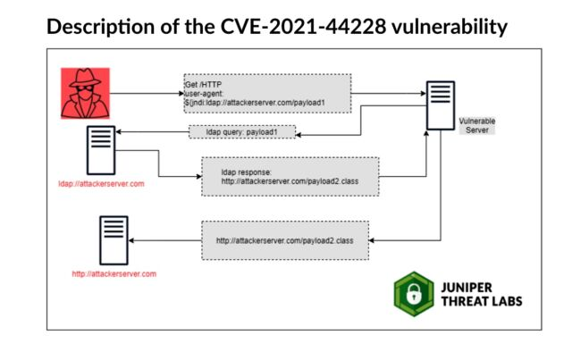

# What's going on?

I have to say this past week has been a real eye-opener for many industries, but I believe the biggest one is the technology industry.
Formally named [CVE-2021-44228](https://nvd.nist.gov/vuln/detail/CVE-2021-44228), the [Log4j](https://logging.apache.org/log4j/2.x/) vulnerability has sent security and dev teams scrambling for the past 5 days, and for good reason.  This vulnerability essentially allows malicious actors to 

>execute arbitrary code loaded from LDAP servers when message lookup substitution is enabled

Many individual's, myself included, are calling this one of the largest and most dangerous vulnerabilities that have been found.  The main reason behind this is the shere number of products that are being effected.  The following is a [short list of some of the companies that are effected](https://www.bleepingcomputer.com/news/security/log4j-list-of-vulnerable-products-and-vendor-advisories/):

* [Adobe](https://helpx.adobe.com/security/security-bulletin.html#:~:text=08/13/2019-,Adobe%20ColdFusion,-Brief)
* [Amazon](https://aws.amazon.com/security/security-bulletins/AWS-2021-006/)
* [Broadcom](https://support.broadcom.com/security-advisory/content/security-advisories/Symantec-Security-Advisory-for-Log4j-2-CVE-2021-44228-Vulnerability/SYMSA19793)
* [Cisco](https://tools.cisco.com/security/center/content/CiscoSecurityAdvisory/cisco-sa-apache-log4j-qRuKNEbd#vp)
* [Debian](https://security-tracker.debian.org/tracker/CVE-2021-44228)
* and more

# When was it discovered?

Aparently Cisco's Talos security team has been observing exploits related to this since [December 2](https://blog.talosintelligence.com/2021/12/apache-log4j-rce-vulnerability.html) although the [earliest exploit found was 04:36:50 UTC on 12/1/2021](https://twitter.com/eastdakota/status/1469800951351427073).  Aparently the primary use for this exploit as seen in the wild has been to [install crypto-mining malware](https://isc.sans.edu/diary/rss/28124), and [add to botnets](https://blog.netlab.360.com/threat-alert-log4j-vulnerability-has-been-adopted-by-two-linux-botnets/).

Microsoft has published [guidance for preventing, detecting, and hunting for](https://www.microsoft.com/security/blog/2021/12/11/guidance-for-preventing-detecting-and-hunting-for-cve-2021-44228-log4j-2-exploitation/?ranMID=24542&ranEAID=TnL5HPStwNw&ranSiteID=TnL5HPStwNw-AhasDh6Dim5RYVuATw6wVQ&epi=TnL5HPStwNw-AhasDh6Dim5RYVuATw6wVQ&irgwc=1&OCID=AID2200057_aff_7593_1243925&tduid=%28ir__2ia36o2d6ckf6kc99qdkuluaeu2xosxtsetirzx200%29%287593%29%281243925%29%28TnL5HPStwNw-AhasDh6Dim5RYVuATw6wVQ%29%28%29&irclickid=_2ia36o2d6ckf6kc99qdkuluaeu2xosxtsetirzx200) the Log4j issue.

# My thoughts

It's safe to say that this discovery has sent a lot of people running and scrambling and working their tails off.I can only imagine the emails that have come down from the security teams.  I must say that whenever I first found out about this issue a few days ago I myself went running. Running straight to our code base is.Thankfully. None of our products were affected. But although none of our products were affected, it still doesn't take away from that sudden heart drop feeling. After confirming that.None of the software that I worked on was affected the very next step in the process was setting up automated scanning using [Snyk](https://snyk.io).  While I have and continue to use Snyk’s CLI tools I didn’t have an automated process to ensure that our products were protected.

During development, we often repeat the phrase [DRY (don’t repeat yourself)](https://en.wikipedia.org/wiki/Don%27t_repeat_yourself), and in doing so often forget what the dangers of this phrase could bring.  I completely agree with it and by no means am I advocating against open-source software, but at the same time we as engineers must take steps to ensure that any potential risks that could be brought in by external software are mitigated.

Let’s face it.  Many software products would be extremely cost prohibitive to build without the assistance of already existing libraries.  But [time](https://portswigger.net/daily-swig/vulnerabilities-in-npm-allowed-threat-actors-to-publish-new-version-of-any-package) and [time](https://arstechnica.com/information-technology/2021/09/npm-package-with-3-million-weekly-downloads-had-a-severe-vulnerability/) and [time](https://www.infoworld.com/article/3048526/nodejs-alert-google-engineer-finds-flaw-in-npm-scripts.html) again we are shown that the potential for issues that we didn’t create to creep into our projects is there.  In my opinion as our tools, programs, and methodologies continue to grow and mature it is important to invest into the [DevSecOps](https://www.redhat.com/en/topics/devops/what-is-devsecops) process.  By building security into our everyday practices we may not be able to completely ensure that our systems are safe, but it can help by ensuring that no security vulnerabilities are introduced into our code and notifying us the moment an issue arises.

## Some tools

For those of you that are in a position to do so, I highly recommend that you take a look at the following automated security tools and speak to your leadership about the importance of implementing a DevSecOps program within your organization.  Now would be the perfect time to do so.

* [Rapid 7](https://www.rapid7.com/products/insightappsec/)
* [SonarQube](https://www.sonarqube.org/)
* [Netsparker](https://www.netsparker.com/)
* [Snyk](https://snyk.io/)
