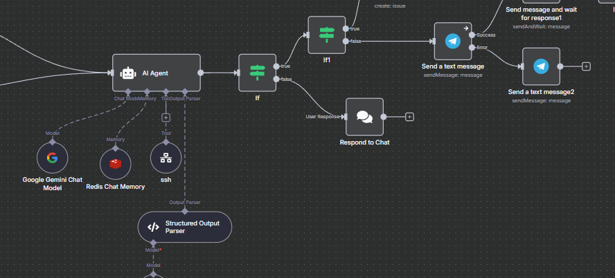

Over the past few years I have gotten big into self-hosting.  My home network has been composed of high-end networking equipment and battery backups for years (since around 2019), but over the past two years or so I've started self-hosting as much as I can.  There's just something comforting knowing that I actually own my data and it's here on my servers.  This includes my movies, photo backups, a full copy of my google drive, along with many other various services running.  

The one down side is that I am the only one that's really technically literate in my household, so unfortunately that leads me to be regularly inundated with requests.  So in response to a video I actually saw from Network Chuck I decided to build my own little agent to manage it all for me.   To be honest, I started on this about a month ago and just regularly make small adjustments here and there.

The screenshot above is a small snippet of the automation. The whole thing focuses around using [N8N](https://n8n.io) to easily manage and maintain my agents and allows for the rapid creation of tools and parameters for the agent to operate with and within. A few things I have it set up to do is to keep me aware of various changes within my network.

Right now, its main job is proactive monitoring. It runs on a regular schedule, checking all my critical services and parsing logs to ensure that no services have crashed on me. If it does find a service that's down, it's set up to proactively troubleshoot the issue. I've been careful with it, of course, it's only allowed to perform write operations with explicit human approval from me. I don't need my AI getting too confident and taking over my network.  I believe there's a whole movie series on what happens when we let AI get carried away!

For manual triggers, I currently have it hooked up to a Telegram message. This lets me invoke it from anywhere, which is super handy.  This also allows my wife, or other trusted individuals that rely on my network to interact with it in plain speech without having to know all the technical details. The eventual goal, though, is to move this over to SMS via Twilio. That will make it even more accessible and less dependent on a single app.

For the agent LLM I've settled on Google's `gemini-flash-lite-latest` model. The primary reasons for this choice were speed and cost. The "flash" model is fast at responding, which is perfect for real-time commands and makes interacting with it feel responsive plus I already have access to the Gemini API through my existing Google subscription, so it doesn't add any extra cost to my monthly bills. That said due to N8N's flexibility I could easily swap in a different model, like one from OpenAI or Claude if I wanted.

## Future Plans

But the real fun is in what's next. My immediate plan is to expand its awareness of the network itself. I already use [Netalertx](https://netalertx.com) to monitor for new devices connecting to my network (gotta keep an eye on things!), so the next logical step is to feed that data to the agent. I want it to be able to actively ping me with details on any new device that pops up, telling me what it is and where it's connecting from, or on average how long it's on the network.

The other big one is more of a parenting and security task. I use [Technitium](https://technitium.com/dns/) as my home DNS server, and I have it set up with rules to block many undesirable domains for any devices that my kids have access to. I plan to have my agent regularly monitor the DNS requests coming from their devices. This isn't about spying, but about having another automated layer to ensure the blocks are working and to get alerts on any concerning patterns. It's just one more task I can offload from my mental plate and let the agent handle.

## So why trust AI?

Ultimately, the main motivation for this project was to get myself out of the loop as the household's single point of tech support. Instead of having to wait until I'm free, my family can now just ask the agent in plain English why something isn't working. Whether it's the network being slow or why a specific movie won't play on the media server. It also gives me significant peace of mind. The agent's proactive monitoring constantly keeping an eye on all my critical services, helping to ensure that potential issues are caught before they turn into real problems for everyone.

## Try it yourself!

If you haven't played around with [N8N](https://n8n.io) before, I highly encourage you to check it out. It's incredibly powerful, and I now have multiple workflows that I use almost daily. Some, like this agent, use Gemini, while others connect to a self-hosted LLM I run locally with [Ollama](https://ollama.com). One of the first workflows I ever built actually scours Reddit for top items and their comments, uses an LLM to generate "News" articles from the content, and then posts them to an internal WordPress site. It even pings our family Discord server when a new article is live, which was a neat way to keep up on current events we might have otherwise missed. We still use it from time to time, and while I've thought about turning it into a public, ad-supported site for passive income, I'm not quite sure how I feel about that.