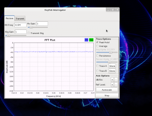

Anyways, just like I said I would I got into trying to actually demodulate the signal for that fan remote…well as it turns out, after tons of research it seems like the method I posted about in my last entry was the easiest way to “demod” a PWM signal, just doing it by hand.  So I’ve moved on to other stuff.  So, been working on attacks against Keyfobs today (that little button you use to unlock/lock your car) and so far so good. Here’s a screenshot of a little program I’m working on to make IDR (intercept, disrupt, replay) attacks on keyfobs a little easier. When it’s done it will basically sit there and listen for you to push a button, when you do it will jam the signal and save the signal to a file. Then when you push it again it will jam that signal, save the second one to a file, the replay the first one (causing your vehicle to lock/unlock as expected).

This will leave the second signal free for use at a later point in time, for example after you walk into the store or whatever.

The screenshot is showing the “Receive” portion of the program, this is what will watch for and intercept the signal when you use your keyfob. It also shows tabs and various settings to influence how it works and go to the jamming portion of the program.  Also, as I’m sure you can all tell…I did this the easy way and just used [GNURadio](https://web.archive.org/web/20150524200808/https://gnuradio.org/).

I’ll post more and actually release the flowgraph when it’s done and working as expected, but it’s starting to look like I may have to craft a few custom blocks to get it to work just the way I want it to.  We’ll see where this goes.  I’m hoping to make it as automated as possible.

I’ll keep working on this until it’s done and keep you all updated…or until someone else finishes a program to do this before me, then of course I’ll just share the link with you guys and move on to something else. :p
