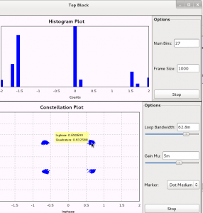
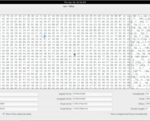

So here I am just browsing through the electro-magnetic spectrum with [gqrx](https://web.archive.org/web/20150524023730/http://gqrx.dk/) and I come across a signal…a strong signal at that.  Obviously this piqued my curiosity so I decided to check it out.  I started out by recording just the raw signal with GNURadio and saving it to a file.  Afterwards I ran it through a few filters and put it up on the scope sink, and FFT.  In the end (with the help of a constellation plot) I was able to figure out it was FSK modulated.  I quickly demodulated the signal and through the contents into another file to check out with a hex editor.

I have no clue what this is, but I do have a pretty good guess.  I did some research and found that these could be the possible culprits:

American H Block Wireless L.L.C.  (aka Dish Network) **Call-sign** – WQTX279 **Use** – H-Block Broadband (voice or data)

Powertel Memphis Licenses, Inc.  (aka Bloomberg) **Call-sign** – KNLF619 **Use** – Personal Communication Services

Cellular South Licenses, LLC (aka ATT) **Call-sign** – WQPX714 **Use** – Personal Communication Services

 

Now, my best guess is that it would either be Cellular South, or Powertel.  I say this because here within the past few months some company just recently installed a new tower about 0.5 miles down the road from my house, and Dish still doesn’t have any infrastructure in place for any wireless networks (even though they own a HUGE chunk of the spectrum).  Odds are it’s Cullular South, but who knows.

 

Anyways, on to some pictures.

_Looking a histogram and constellation of the signal._

 

_Looking at the raw bits from the signal. (9/10 they are encrypted so I stopped here)_
