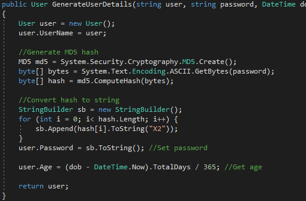
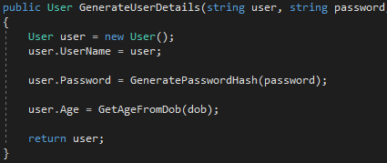

That's right, I said it. Comments are evil. But wait a minute, I hear you say, they tell us about the code, help us explain what is going on, etc etc.  I'm not saying comments can't be useful in code, of course they can, but that vast majority are not.  Most that I have seen are simply useless and some are even downright evil.

> "Code never lies, comments sometimes do." - Ron Jeffries

# Introduction

There are few things that can stir up a debate in software development than the purpose and need for comments.  Throughout my time programming I have met two extreme groups.  Those that believe they should be everywhere, and those that believe that code should never contain them.  I tend to fall right in the middle.  I believe there should never be a comment, unless they are required.  Sounds confusing but let me explain.

Through my experience the most common time I see comments it usually falls into one of 4 circumstances:

- The method/function is poorly names
- The code is too long
- The code is too complicated
- It is your company's policy to comment

 

# Poor Naming

[Phil Karlton](http://www.meerkat.com/karlton/), a former software engineer at Netscape, uttered the now  infamous words:  "There are only two hard things in Computer Science: cache invalidation and naming things."

This quote continues to prove true over two decades after its utterance.  Naming things, however, is something that we must take seriously.  Many new developers tend to use easy variable and methods names, sometimes even single letters, however software engineering is a profession.  If you need to leave a comment simply to describe what something is doing, maybe it's time to change the name.  A method with the signature "User GatherUserData(int userId)" is much more helpful than "User DoWork(int id)".  In his book, "[Refactoring: Improving the Design of Existing Code](https://amzn.to/2u7FyDb)", Martin Fowler states:

> An important part of the code style I am advocating is small methods to factor complex processes.  Done badly, this can lead you on a merry dance to find out what all the little methods do.  **The key to avoiding this merry dance is naming the methods.**

Take a look at nearly any open-source project out there and you will usually find well-written, self-documenting, code.  The purposes behind this is to ease readability, and force developers to write code after the function name.

#### Comments aren't always updated

As was quoted at the beginning of this article: "Code never lies, comments sometimes do.".  Code is often regularly updated and changed, a method or function that does one thing, one way, one day, may not the next and developers (speaking from experience) often forget to update comments to match their work.

 

# Long and Complicated Code

In his book [Code Complete, Steve McConnell](https://amzn.to/2KKacgf) identifies two possible reasons one may need to place a comment:

 

> - The single line is complicated enough to need an explanation.
> - The single line once had an error, and you want a record of the error.

This is true in most places and tends to be the most common reasons that developers feel the need to comment their code.  What better way to explain how this long complex algorithm works, or why it's needed?   This is where we delve into some bad areas.  If you feel you need to place comments every few lines to explain what a method or function is doing it may be a good idea to step back.  Ask youself this:  If I can't understand what this is doing without comments, how will a developer 10 years from now?  [Refactoring Guru](https://refactoring.guru/smells/long-method) wrote a great article on this exact topic.  In his article, he explains that if you feel as though you have to place a comment, the code you are commenting is best taken out and placed inside it's own method.

Breaking one monolithic function down into many smaller bits not only keeps you from dirtying up your code, but also greatly increases readability.  Take a look at the two methods below and see which one you find easier to understand:

I'm sure now you're beginning to see the point and even agreeing.

 

# Company Policy

First off I'm going to say that if it's your company's policy to leave a little snippet every time someone touches a function, or specific piece of code....RUN! Run now and never look back!  Believe it or not there are some companies out there that have this in place.  I have no clue as to why, but thankfully it looks like most are moving away from this practice.

If you can't just run away, and you are not able to convince your supervisors to change this practice, then sadly you're just locked in and there is really nothing that I can do to help.  I'm pretty sure that's about all I can say on this topic.

# Conclusion

In closing remember, comments are tools and any tool can be misused.  Explain "why" something is there, or something is happening, not what or how in your comments.  Comments, when used appropriately, are a very valuable asset.  The majority of the time they are sadly misused and it's this that is creating the "comment everything" and "comment nothing" extremist viewpoints.

 

# Further Reading

Check out some of the posts below for further reading on this topic:

- [https://medium.freecodecamp.org/code-comments-the-good-the-bad-and-the-ugly-be9cc65fbf83](https://medium.freecodecamp.org/code-comments-the-good-the-bad-and-the-ugly-be9cc65fbf83)
- [https://simpleprogrammer.com/why-comments-are-stupid-a-real-example/](https://simpleprogrammer.com/why-comments-are-stupid-a-real-example/)
- [https://visualstudiomagazine.com/articles/2013/06/01/roc-rocks.aspx](https://visualstudiomagazine.com/articles/2013/06/01/roc-rocks.aspx)
- [https://medium.com/@navdeepsingh\_2336/good-code-vs-bad-code-35624b4e91bc](https://medium.com/@navdeepsingh_2336/good-code-vs-bad-code-35624b4e91bc)

https://medium.com/@navdeepsingh\_2336/good-code-vs-bad-code-35624b4e91bc
