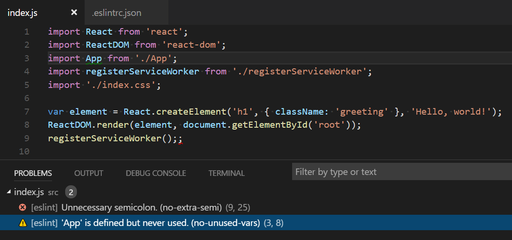

So what exactly is code lint?  I'm sure we've all heard of a linter but how many out there have actually taken the time to sit down and use one?  What are they used for?  Well, getting rid of code lint, of course!  A linter is defined by [Wikipedia](https://en.wikipedia.org/wiki/Lint_(software)) as:

> A linter or lint refers to tools that analyze source code to flag programming errors, bugs, stylistic errors, and suspicious constructs.

So obviously feeding off of the definition of a linter, a good explanation for the lint itself could possibly be clearly defined as:

> Code lint is a software programming "[smell](https://en.wikipedia.org/wiki/Code_smell)" that is identified by programming errors, bugs, stylistic errors and/or suspicious constructs.

I personally believe that this is a good explanation to those.  There are linters out there for [nearly every language](https://en.wikipedia.org/wiki/List_of_tools_for_static_code_analysis), however; I'm going to focus on JavaScript for soon-to-be apparent reasons.

# Intro

I personally have a big gripe with JavaScript.  I can't stand it, due to how loosely typed it is.  Now, this is not to say that JS is a bad language, this is just my personal opinion.  No compiler checking, no syntactic norms, etc etc.   Just because of this, over the past year I have moved from using JS over to [TypeScript](https://www.typescriptlang.org/) due to it's very statically typed nature.  It's just where I feel more at home at.  I used to hate working with JavaScript and never realizing that the type of a variable changed somewhere, or the state of something changed in an unexpected way.  I'm sure we can all agree that debugging JavaScript is cruel and unusual punishment.

## So how can "linting" help?

Well, now that you can kind of understand where I'm heading with this, you may ask...ok? So how can linting help me?  Well, I have a small list here for you:

- Prevent bugs
- Save time in development
- Promote best practices

Keep in mind that a linter is a tool that simply inspects your code and makes sure that it follows certain "rules".  These rules you or your team will have to define ahead of time.

# Linters

There are tons of linters out there, but I figured I could just compare and contrast some of the most popular ones.  By looking at the crude comparison graphic below, you can tell that not all Linters are created equal.  Many linters are created with a specific purpose in mind.

If you are just getting started with Linting, I would recommend [JSLint](https://www.jslint.com/) as it's already there and ready to be used with no configuration required.  If you would like a more details comparison of these be sure to check out [SitePoint](https://www.sitepoint.com/comparison-javascript-linting-tools/).  Their comparison is actually what the graphic above is based on.

 

## Configuration

Configuring most linters is usually fairly straight-forward.  Let's take a look at a typical configuration file for ESLint.

 

As you can see the config values are comprised of a very simple JSON object.  In here you can specify the various rules that you want your team or organization to follow.  The beautiful thing about file-based configuration linters is that you can check the config file into source control to be easily shared among the team.  While I'm not going to go into depth on how to configure all the linters, here is a [brief tutorial on setting up ESLint](http://voidcanvas.com/brief-tutorial-on-eslint/).

 

## Linting errors and warnings

Linters would be fairly useless if they didn't give you any real-time feedback.  The entire purpose of using a linter is to provide you with simple feedback on how your code will perform or any issues with styling, design, syntax, etc.   If you look at the below image you can see what this looks like from ESLint in VSCode.  As you can see the linter informs the developer of an error in their code (extra semicolon) and another possible issue of a variable being declared but never used.

 

# Conclusion

I'm hoping that by this point I have convinced you of the benefit and ease of using these utilities.  The only thing left to do know is to pick out your favorite one!  Once you get it picked out, start using it to get all of that lint off your clothes...er...code!
