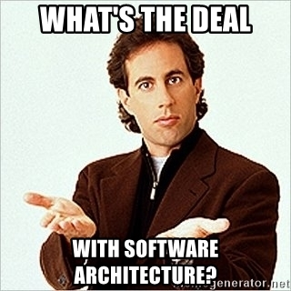
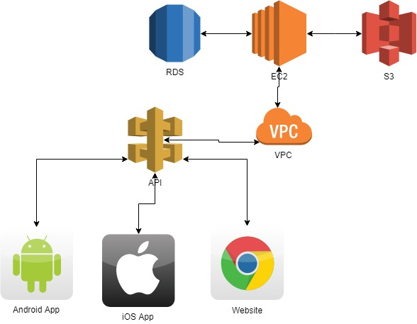

Throughout my time developing software I have seen many different architectures, but on some of my recent projects, there is one that stands above the rest. API Driven Development. I absolutely love this architecture and I'm sure most of you would too.

## What is API Driven Development?

Before I go into my fanboy spiel of why APIDD is the best there is an why everyone should use it, let's first discuss what it is.

API Driven Development is pretty much exactly what it sounds like. Development that is driven by the API. The way this works is before any development takes place the API is planned out. The API is created before the application's front-end and backend.

This allows a standard method of accessing data for all platforms that the application may be developed for. This approach will also cut down on bugs by forcing developers to adhere to a specific contract that is determined by the API.

## What's one good reason for it?

Recently many of my clients have been asking for mobile apps and websites that go along with them. For a project like this, APIDD is perfect! Let me start off by showing a diagram.

Common API DD Architecture

As you can see from the diagram, the only way to access storage, the database, or any other server-side resources is through the API. The ensures that all applications regardless of what language they're made in, or what platform they are running on receive the same data.

By forcing everything to go through the API this drastically speeds up development for custom applications by ensuring that front-end and backend engineers can continue to simultaneously write code based on the API Contract.

## Is this right for my project?

> "Why build a house when all you need is a shed?"
> 
> \-Anonymous

The only person that can determine if this would be right for your particular project is you. If the project is going to be a simple database-driven website or just a mobile app, I would say no. With API driven development there is a lot of setup time up front, and unless you specifically need the portability and flexibility it offers, I would go with another style.

## Where can I find out more details?

I'm a realist and as such, I understand that I cannot convey all the information on this particular architecture; as such, I would refer you to a wonderful article written by [Aaron Lazar](https://hub.packtpub.com/author/aaronl/) title "[8 Reasons why architects love API driven architecture](https://hub.packtpub.com/architects-love-api-driven-architecture/)". He does a fantastic job of going over the pros and cons and I'm sure of explaining the architecture itself.
