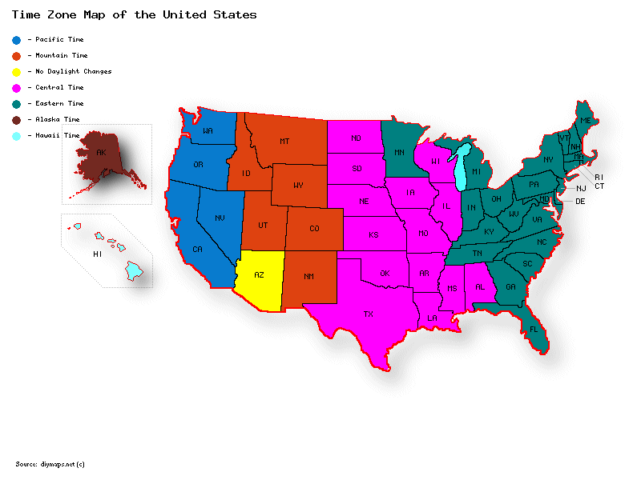
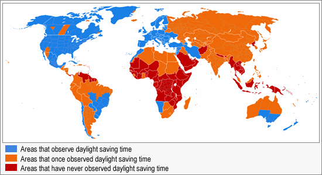
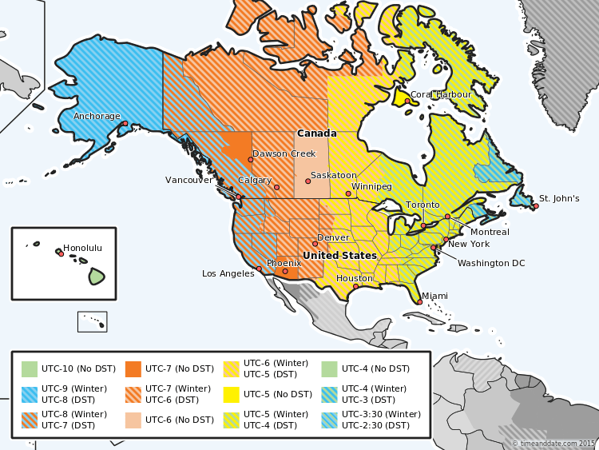

There are many aggravating things in programming. You have race conditions, thread locks, cache validation, and many others, but one thing can be one of the biggest headaches if not taken into account. Time. Handling time sounds like a fairly straight forward process, right? Get the current time, store it somewhere, and display it when you need to. If only it were that simple.


"We were in the right place at the right time, but unfortunately, we were in the wrong time zone."

> How did it get so late so soon?
> 
> Dr. Suess

Okay, so I'm not going to lie I originally started writing this post over a year ago when I was working at [LocalMed LLC](https://www.localmed.com/) (great company and service BTW) dealing with various dental practices in different time zones. For some reason or another I never came back to finish it. Only after changing website hosts did I realize that this was sitting in my drafts and I have to tell you it still holds true today. Currently I'm working for [Pivot](https://www.pivotts.com/) and focusing mainly on telecommunication solutions. With call centers everywhere and many with different departments in different time zones, time is still my biggest enemy.

I guess I probably need to get down into the nitty-gritty and try to better explain myself. Since I'm based in the United States that's where I'm focusing at but the same ideas can be easily transferred to other parts of the globe.

## Time Zones

Let's first start off by saying we're building an employee time-clock application. This is going to be web-based and allow our employees to clock in, take breaks, and clock out of their shift regardless of where they are in the world. Seems pretty straight forward right? We could just have a button on a page and when the user clicks it we store that time in the database along with the user's Id and a reason (Clock In, Clock Out, Start Break, End Break).

Now lets say that it's 8AM in our Headquarters in Chicago and we're expecting all of our employees to begin clocking in so we go and check our records. Bob, who lives in Miami has already clocked in an hour ago at 7AM and it takes another hour (at 9AM) for Jim in Houston to clock in! What is going on?! Do we have some sort of mutiny on our hands?! Before you phone the HR lead you laugh to yourself. Oh right, time zones.



Time zones became a thing in the early 19th century as railway's became increasingly prevalent. Before the introduction of time zones cities used [mean solar time](https://en.wikipedia.org/wiki/Solar_time#Mean_solar_time), but seeing as this could be off by 15 minutes it became increasingly inconvenient as railway cars would be very late or early depending on where you were.

In America each railroad used it's own standard time based on the local time of it's headquarters to publish it's train's schedules. This became extremely confusing as commonly each railroad was on a different clock. The travelers back then got a lucky break, and started current developer headaches, in 1870. While the idea was thought of earlier it was in 1870 that [Charles F. Dowd](https://en.wikipedia.org/wiki/Charles_F._Dowd) proposed four time zones with the first centered on Washington D.C. These time zones were officially set in stone by the [Standard Time Act](https://en.wikipedia.org/wiki/Standard_Time_Act) on March 19,1918 by the United States Congress.

## Daylight Saving Time

Daylight saving time (DST), is another concept that many of us are familiar with, programmer or not. While proposed and lobbied earlier, daylight saving time came to fruition on July 1, 1908 in Port Arthur Ontario. While initially introduced as a way to get in leisure activities while the sun was still up for shift workers, the real push came from Germany in World War I in 1916. Germany and it's ally [Austria-Hungary](https://en.wikipedia.org/wiki/Austria-Hungary) were the first countries to introduce DST in order to conserve coal reserves during wartime. Britain and the majority of it's allies soon followed, with the US adopting it in 1918.

After the war most abandoned DST as the need to conserve reserves no longer presented an obstacle with a few countries holding out, the United States being one of them. During WWII there was another spike in the adoption of DST, with another during the [1970s energy crisis](https://en.wikipedia.org/wiki/1970s_energy_crisis).

So now that we have a brief history, what exactly is DST? Well, for those of you that are unaware it's a change in clock settings by one hour. Usually consisting of moving the clock forward by one hour on a designated day, followed by moving the clock back an hour on a designated day later in the year. I've put together a simple chart below to show how _some_ areas in the US handle it.

<table><tbody><tr><td>Month</td><td>Without DST</td><td>With DST</td></tr><tr><td>January</td><td>1PM</td><td>1PM</td></tr><tr><td>February</td><td>1PM</td><td>1PM</td></tr><tr><td>March</td><td>1PM</td><td>2PM</td></tr><tr><td>April</td><td>1PM</td><td>2PM</td></tr><tr><td>May</td><td>1PM</td><td>2PM</td></tr><tr><td>June</td><td>1PM</td><td>2PM</td></tr><tr><td>July</td><td>1PM</td><td>2PM</td></tr><tr><td>August</td><td>1PM</td><td>2PM</td></tr><tr><td>September</td><td>1PM</td><td>2PM</td></tr><tr><td>October</td><td>1PM</td><td>2PM</td></tr><tr><td>November</td><td>1PM</td><td>1PM</td></tr><tr><td>December</td><td>1PM</td><td>1PM</td></tr></tbody></table>

Daylight Saving Time Example

As you can see I stated above that this is how some areas in the US handle it, the reason for this is that all areas in the US observe daylight saving time except Arizona (excluding the Navajo Nation) and Hawaii.



Chart showing DST observations

## DST+Time zones = ???

So as you can tell from above we took something seemingly simple (time) and added 1 layer of complexity called time zones, then we added another called daylight saving time, then we added another as observance of DST is "splotchy" at best. So what does this look like when we put it all together? I'm glad you asked.



Time zones with DST observance

With these complications being enough it adds to it that some areas seem to jump [in and out of accepting DST on a whim](https://en.wikipedia.org/wiki/Daylight_saving_time_in_the_United_States#Local_DST_observance), and that [different areas have different calendars](https://devblogs.microsoft.com/dotnet/handling-a-new-era-in-the-japanese-calendar-in-net/), but that's adding too much onto an already convoluted topic.

So now the question really boils down to how do we as programmers handle time? In systems where peoples' lives, jobs, families, and more are potentially on the line a large burden gets placed on our shoulders. Development, testing, deployment everything is made slightly more difficult by these.

Thankfully people smarter than myself devised a clever idea on how to store this information without having to worry too much about the intricacies of time zones or DST.

## Offsets

_Warning: Entering .NET territory_

Enter DateTimeOffsets. A [DateTimeOffset](https://docs.microsoft.com/en-us/dotnet/api/system.datetimeoffset) provides us with a useful way to dealing with time, and storing this information. Of course I'm sure many of you know of DateTimes which is implemented in nearly every modern programming language, but many seem to get confused on DateTimes vs DateTimeOffsets. A simplified way of looking at it is a DateTimeOffset is simply a [DateTime](https://docs.microsoft.com/en-us/dotnet/api/system.datetime) stored with and [Offset](https://docs.microsoft.com/en-us/dotnet/api/system.datetimeoffset.offset).

So what is an offset? To put it bluntly, it's the difference between the stored DateTime and [Coordinated Universal Time (UTC)](https://en.wikipedia.org/wiki/Coordinated_Universal_Time). In order to make use of this we do have to remember one thing, while a DateTimeOffset is useful the offset is not aware of the concept of time zones or DST. To take from Microsoft documentation:

> it is not a fully time zone-aware data structure. While an offset from UTC is one characteristic of a time zone, it does not unambiguously identify a time zone. Not only do multiple time zones share the same offset from UTC, but the offset of a single time zone changes if it observes daylight saving time. This means that, as soon as a [DateTimeOffset](https://docs.microsoft.com/en-us/dotnet/api/system.datetimeoffset?view=netcore-3.1) value is disassociated from its time zone, it can no longer be unambiguously linked back to its original time zone.
> 
> https://docs.microsoft.com/en-us/dotnet/api/system.datetimeoffset

So this essentially gives us one tool to use to combat the complexities of time management, but not the full package. If you were wanting to keep track of time in various areas you would essentially be required to manage:

- Time being stored
- Offset (or the time zone)
- Whether or not the area observes DST

So as you can see while DateTimeOffset does help us out some, it doesn't solve the problem. Thankfully another talented developer covered this in [this blog post](https://blog.nodatime.org/2011/08/what-wrong-with-datetime-anyway.html) which I found while writing this paragraph!

## One tool to rule them all...

...and in time bind them. By far best tool I have been able to locate is [NodaTime](https://nodatime.org) which was initially conceived by [Jon Skeet](https://codeblog.jonskeet.uk/), a fantastic and incredibly intelligent developer. He's always writing, helping people on [StackOverflow](https://stackoverflow.com/users/22656/jon-skeet), and working on cool things. I don't know him personally and have never spoke with him but let's just say I have a lot of respect for him.

Jon goes to explain the purpose behind NodaTime's existence as:

> Noda Time exists for .NET for the same reason that [Joda Time](http://www.joda.org/joda-time/) exists for Java: the built-in libraries for handling dates and times are inadequate. Both platforms provide far too few types to represent date and time values in a way which encourages the developer to really consider what kind of data they're dealing with... which in turn makes it hard to treat the data consistently.
> 
> While the .NET date/time types are actually easier to use than their Java counterparts (largely as a result of being immutable structs instead of mutable classes), they're actually less powerful - in .NET, there's no such concept of "a date and time in a specific time zone" for example.
> 
> https://nodatime.org/3.0.x/userguide/rationale

NodaTime is by far one of the best and most complete time libraries out there. As an example of it's ease of use I present you with the following code. Disclaimer: This was copied and pasted straight from the NodaTime website as I'm too lazy to come up with my own examples at this point, and this gets the point across.

```csharp
// Instant represents time from epoch
Instant now = SystemClock.Instance.GetCurrentInstant();

// Convert an instant to a ZonedDateTime
ZonedDateTime nowInIsoUtc = now.InUtc();

// Create a duration
Duration duration = Duration.FromMinutes(3);

// Add it to our ZonedDateTime
ZonedDateTime thenInIsoUtc = nowInIsoUtc + duration;

// Time zone support (multiple providers)
var london = DateTimeZoneProviders.Tzdb\["Europe/London"\];

// Time zone conversions
var localDate = new LocalDateTime(2012, 3, 27, 0, 45, 00);
var before = london.AtStrictly(localDate);
```

## Wrapping up

After spending years (actually just a few hours) writing this post I feel like I've hopefully fully conveyed the [PITA](https://www.thefreedictionary.com/Pain+In+the+Ass) that is managing time in an application. In all honesty I know I didn't cover everything because let's be honest entire books can be written on this subject. But I'll leave you with a few helpful links to assist in moving forward:

- [Daylight saving time and time zone best practices](https://stackoverflow.com/questions/2532729/daylight-saving-time-and-time-zone-best-practices)
- [DateTime vs DateTimeOffset](https://stackoverflow.com/questions/4331189/datetime-vs-datetimeoffset)
- [NodaTime Blog](https://blog.nodatime.org/)
- [Jon Skeet's Blog](https://codeblog.jonskeet.uk/)
